# AutoReportSystem Architecture

## System Overview

AutoReportSystem is a comprehensive task management and automated reporting platform built with modern Python technologies. The system follows a layered architecture pattern with clear separation of concerns.

## Architecture Diagram

```mermaid
flowchart TB
    %% User Interface Layer
    subgraph PresentationLayer ["Presentation Layer"]
        UI[Streamlit Web UI]
        subgraph UIComponents ["UI Components"]
            Dashboard[Dashboard]
            Jobs[Jobs Dashboard]
            Templates[Template Designer]
            Settings[Settings]
            Auth[Authentication]
        end
    end

    %% Application Layer
    subgraph ApplicationLayer ["Application Layer"]
        subgraph CoreInterfaces ["Core Interfaces"]
            TaskInterface[Task Interface]
            JobInterface[Job Interface]
            UserInterface[User Interface]
            TemplateInterface[Template Interface]
            SMTPInterface[SMTP Interface]
            AnalyticsInterface[Analytics Interface]
            MetricsInterface[Metrics Interface]
        end

        subgraph BusinessServices ["Business Services"]
            ReportGenerator[Report Generator]
            EncryptionService[Encryption Service]
            Scheduler[Job Scheduler]
        end
    end

    %% Security Layer
    subgraph SecurityLayer ["Security Layer"]
        AuthHandler[Auth Handler]
        SessionManager[Session Manager]
        RouteProtection[Route Protection]
        Middleware[Security Middleware]
    end

    %% Integration Layer
    subgraph IntegrationLayer ["Integration Layer"]
        subgraph EmailIntegration ["Email Integration"]
            EmailClient[Email Client]
            TemplateLoader[Template Loader]
            ContentLoader[Content Loader]
        end

        subgraph GitIntegration ["Git Integration"]
            AutoCommit[Auto Commit]
            GitConfig[Git Config]
        end
    end

    %% Data Layer
    subgraph DataLayer ["Data Layer"]
        subgraph DatabaseModels ["Database Models"]
            UserModel[User]
            TaskModel[Task]
            JobModel[Job]
            TemplateModel[Email Template]
            SMTPModel[SMTP Config]
            SessionModel[User Session]
        end

        Database[(PostgreSQL Database)]
        DBConnector[DB Connector]
        Migrations[Alembic Migrations]
    end

    %% External Systems
    subgraph ExternalSystems ["External Systems"]
        SMTP[SMTP Server]
        GitRepo[Git Repository]
        FileSystem[File System]
    end

    %% Infrastructure
    subgraph Infrastructure ["Infrastructure"]
        Config[Configuration]
        Logging[Logging]
        Monitoring[System Monitoring]
    end

    %% Connections
    UI --> TaskInterface
    UI --> JobInterface
    UI --> UserInterface
    UI --> TemplateInterface
    UI --> SMTPInterface
    UI --> AnalyticsInterface
    UI --> MetricsInterface

    TaskInterface --> TaskModel
    JobInterface --> JobModel
    UserInterface --> UserModel
    TemplateInterface --> TemplateModel
    SMTPInterface --> SMTPModel

    ReportGenerator --> EmailClient
    ReportGenerator --> TemplateLoader
    Scheduler --> JobModel
    Scheduler --> ReportGenerator

    AuthHandler --> UserModel
    SessionManager --> SessionModel
    RouteProtection --> SessionManager
    Middleware --> RouteProtection

    EmailClient --> SMTP
    AutoCommit --> GitRepo
    TemplateLoader --> FileSystem
    ContentLoader --> FileSystem

    DBConnector --> Database
    UserModel --> Database
    TaskModel --> Database
    JobModel --> Database
    TemplateModel --> Database
    SMTPModel --> Database
    SessionModel --> Database

    Migrations --> Database
    Config --> Database
    Logging --> FileSystem
    Monitoring --> Database

    %% Styling
    classDef uiLayer fill:#e1f5fe,stroke:#01579b,stroke-width:2px
    classDef appLayer fill:#f3e5f5,stroke:#4a148c,stroke-width:2px
    classDef securityLayer fill:#fff3e0,stroke:#e65100,stroke-width:2px
    classDef integrationLayer fill:#e8f5e8,stroke:#1b5e20,stroke-width:2px
    classDef dataLayer fill:#fce4ec,stroke:#880e4f,stroke-width:2px
    classDef externalLayer fill:#f1f8e9,stroke:#33691e,stroke-width:2px
    classDef infraLayer fill:#fff8e1,stroke:#f57f17,stroke-width:2px

    class UI,Dashboard,Jobs,Templates,Settings,Auth uiLayer
    class TaskInterface,JobInterface,UserInterface,TemplateInterface,SMTPInterface,AnalyticsInterface,MetricsInterface,ReportGenerator,EncryptionService,Scheduler appLayer
    class AuthHandler,SessionManager,RouteProtection,Middleware securityLayer
    class EmailClient,TemplateLoader,ContentLoader,AutoCommit,GitConfig integrationLayer
    class UserModel,TaskModel,JobModel,TemplateModel,SMTPModel,SessionModel,Database,DBConnector,Migrations dataLayer
    class SMTP,GitRepo,FileSystem externalLayer
    class Config,Logging,Monitoring infraLayer
```

## Technology Stack

### Frontend

- **Streamlit**: Modern Python web framework for rapid UI development
- **Plotly**: Interactive data visualization and charts
- **Custom CSS**: Enhanced styling for modern UI/UX

### Backend

- **FastAPI**: High-performance async web framework (for API endpoints)
- **SQLAlchemy**: Modern Python SQL toolkit and ORM
- **Alembic**: Database migration tool
- **APScheduler**: Advanced Python Scheduler for background jobs

### Database

- **PostgreSQL**: Primary relational database
- **AsyncPG**: Async PostgreSQL driver for high performance

### Security

- **bcrypt**: Password hashing
- **Custom Session Management**: Secure user session handling
- **Route Protection**: Role-based access control
- **Encryption Service**: Data encryption for sensitive information

### Integrations

- **SMTP**: Email delivery system
- **Git**: Version control integration
- **File System**: Template and content management

### Infrastructure

- **Docker**: Containerization support
- **Python-dotenv**: Environment configuration
- **Logging**: Comprehensive application logging
- **System Monitoring**: Performance and health monitoring

## Key Features

### 🎯 Task Management

- **Kanban Board**: Visual task organization with drag-and-drop
- **Status Tracking**: Todo, In Progress, Pending, Completed
- **Priority Levels**: Low, Medium, High, Urgent
- **Due Date Management**: Smart color-coded urgency indicators
- **Task Analytics**: Productivity insights and trends

### 📊 Dashboard & Analytics

- **Real-time Metrics**: Task completion rates and productivity stats
- **Visual Charts**: Interactive Plotly visualizations
- **System Monitoring**: CPU, memory, and disk usage tracking
- **Historical Trends**: 30-day completion and creation trends

### ⚙️ Job Automation

- **Scheduled Jobs**: Weekly, monthly, daily, and custom schedules
- **Report Generation**: Automated report creation and delivery
- **Email Integration**: SMTP-based email delivery system
- **Job Monitoring**: Real-time job status and execution tracking

### 📝 Template Management

- **Email Templates**: Rich HTML template designer
- **Dynamic Content**: Variable substitution and personalization
- **Template Categories**: Organized template library
- **Preview System**: Real-time template preview

### 🔐 Security

- **User Authentication**: Secure login/signup system
- **Session Management**: Persistent and secure user sessions
- **Route Protection**: Role-based access control
- **Data Encryption**: Sensitive data protection

## Data Models

### Core Entities

- **User**: System users with roles and permissions
- **Task**: Project tasks with status, priority, and due dates
- **Job**: Scheduled automation jobs
- **EmailTemplate**: Reusable email templates
- **SMTPConf**: Email server configurations
- **UserSession**: Secure session management

### Relationships

- Users can have multiple Tasks, Jobs, Templates, and Sessions
- Tasks maintain status history for audit trails
- Jobs can reference Templates for automated reporting
- Sessions provide secure user state management

## Deployment Architecture

### Development

- Local development with SQLite/PostgreSQL
- Hot-reload with Streamlit development server
- Environment-based configuration

### Production

- Docker containerization
- PostgreSQL database
- SMTP integration for email delivery
- File-based logging and monitoring

## Security Considerations

### Authentication & Authorization

- Secure password hashing with bcrypt
- Session-based authentication
- Route-level access control
- CSRF protection through Streamlit

### Data Protection

- Encrypted sensitive data storage
- Secure database connections
- Environment-based secrets management
- Input validation and sanitization

### Infrastructure Security

- Container-based deployment
- Database connection pooling
- Secure SMTP configurations
- Audit logging for security events

## Performance Optimizations

### Database

- Async database operations with AsyncPG
- Connection pooling for scalability
- Indexed queries for fast lookups
- Efficient relationship loading

### Frontend

- Streamlit caching for improved performance
- Lazy loading of dashboard components
- Optimized chart rendering with Plotly
- Responsive design for mobile devices

### Background Processing

- Async job scheduling with APScheduler
- Non-blocking email delivery
- Efficient report generation
- Resource monitoring and alerting

## Future Enhancements

### Planned Features

- **API Integration**: RESTful API for external integrations
- **Mobile App**: Native mobile application
- **Advanced Analytics**: Machine learning insights
- **Team Collaboration**: Multi-user project management
- **Cloud Deployment**: AWS/Azure deployment options
- **Notification System**: Real-time notifications and alerts

### Scalability Improvements

- **Microservices Architecture**: Service decomposition
- **Message Queues**: Async task processing
- **Caching Layer**: Redis for performance
- **Load Balancing**: Multi-instance deployment
- **Database Sharding**: Horizontal scaling

This architecture provides a solid foundation for a scalable, secure, and maintainable task management and reporting system.
